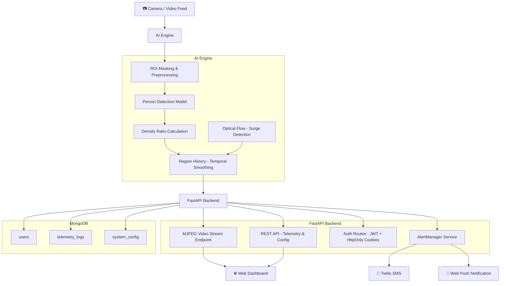

<div align="center">

# 🚨 Real-Time AI Stampede Risk Monitor

### An intelligent, production-grade computer vision system that detects dangerous crowd surges and prevents stampedes before they happen.

[](https://python.org)
[](https://fastapi.tiangolo.com)
[](https://mongodb.com)
[](https://opencv.org)
[](https://twilio.com)
[](LICENSE)

<br/>

> Built as a Capstone Engineering Project — combinating real-time AI, event-driven alerting, and secure web infrastructure into one unified public-safety platform.

</div>

---

<!-- SCREENSHOT: Replace the block below with your actual banner/hero screenshot of the dashboard -->
> 📸 **[SCREENSHOT REQUIRED]** — Insert a full-width screenshot of the main dashboard here (showing live video feed with AI overlays, telemetry panels, and risk indicator).
> 


>


---

## 📖 Table of Contents

- [🎯 What It Does](#-what-it-does)
- [⚙️ How It Works](#️-how-it-works)
- [🧠 System Architecture](#-system-architecture)
- [✨ Key Features](#-key-features)
- [🛠️ Technology Stack](#️-technology-stack)
- [📸 Screenshots](#-screenshots)
- [🚀 Getting Started](#-getting-started)
- [📁 Project Structure](#-project-structure)
- [🔬 Engineering Highlights](#-engineering-highlights)
- [👨‍💻 Team](#-team)

---

## 🎯 What It Does

Every year, crowd stampedes claim hundreds of lives at concerts, pilgrimages, and public events — most triggered not by any single catastrophic event, but by **dangerous crowd density building up undetected** over several minutes.

This system provides a solution: an AI-powered monitor that watches live camera feeds 24/7 and gives security personnel an **proactive, real-time warning** — well before a crowd situation turns fatal.

It calculates crowd density in user-defined zones, tracks sudden kinetic surges in the crowd (indicative of panic), and fires **multi-channel alerts** (SMS + Desktop Notifications) the moment thresholds are breached.

---

## ⚙️ How It Works

The system operates as a continuous, end-to-end pipeline:

```
1. 📷  Live camera feed is ingested (webcam or CCTV stream)
         │
2. 🧠  AI Engine processes each frame in real-time:
         │  ├─ Detects every person in user-defined zones (ROI)
         │  ├─ Calculates Density Ratio (% of zone occupied by people)
         │  └─ Tracks crowd velocity via Optical Flow (surge detection)
         │
3. 📊  Smoothed risk score is computed using a Moving Average
         │  └─ Prevents false positives from momentary camera glitches
         │
4. 🌐  FastAPI backend streams annotated video + live metrics to dashboard
         │
5. 🚨  AlertManager evaluates risk against configurable thresholds:
         │  ├─ If CRITICAL → Send SMS via Twilio
         │  ├─ If CRITICAL → Push browser notification via VAPID
         │  └─ Start cooldown timer (prevents notification spam)
         │
6. 📱  Security personnel receive immediate multi-channel notification
```

---

## 🧠 System Architecture



---

## ✨ Key Features

| Feature | Description |
|---|---|
| 🎥 **Live AI Video Stream** | Real-time annotated video feed streamed via MJPEG with bounding boxes and risk overlays |
| 📐 **Custom Zone Detection** | Define polygon ROIs on the camera view to focus monitoring on specific choke points |
| 📊 **Density Ratio Metric** | Smart % metric — not a raw headcount — normalized to the size of the monitored zone |
| 💨 **Surge Detection** | Optical Flow analysis detects sudden crowd velocity spikes indicating panic |
| 📈 **Temporal Smoothing** | Moving Average prevents false positives caused by camera glitches or momentary occlusions |
| 📲 **SMS Alerting (Twilio)** | Carrier-grade SMS dispatched instantly when critical thresholds are breached |
| 🔔 **Web Push Notifications** | VAPID-secured native OS notifications — fires even when the dashboard is minimized |
| ⏱️ **Cooldown Throttling** | Smart alert cooldown prevents notification fatigue during sustained events |
| 🔐 **JWT Authentication** | HttpOnly cookie-based sessions protect all routes against XSS session theft |
| 💾 **Persistent Config** | Thresholds and ROI settings saved to MongoDB — survives server restarts |
| 📋 **Telemetry History** | Every risk event is logged to the database for post-event forensic analysis |

---

## 🛠️ Technology Stack

### Backend
- **[FastAPI](https://fastapi.tiangolo.com/)** — Async Python web framework; handles video streaming, REST APIs, and WebSockets
- **[Uvicorn](https://www.uvicorn.org/)** — Lightning-fast ASGI server
- **[PyMongo / Motor](https://motor.readthedocs.io/)** — MongoDB driver (async-compatible)
- **[Python-JOSE](https://github.com/mpdavis/python-jose)** — JWT encoding/decoding
- **[Passlib + bcrypt](https://passlib.readthedocs.io/)** — Cryptographic password hashing

### AI & Computer Vision
- **[OpenCV](https://opencv.org/)** — Frame capture, ROI masking, bounding box rendering, Optical Flow
- **Custom Density Estimator** — Proprietary density ratio calculator with temporal smoothing (`density/` module)
- **Custom Motion Tracker** — Gunnar Farneback Optical Flow for velocity analysis (`v2/motion/`)

### Database
- **[MongoDB](https://www.mongodb.com/)** — NoSQL document store for users, configs, and telemetry logs

### Frontend
- **HTML5, CSS3, Vanilla JavaScript** — Zero-framework, high-performance client for rapid DOM updates
- **Web Push API + Service Workers** — Browser-native push notifications without proprietary platforms

### Alerting
- **[Twilio](https://www.twilio.com/)** — Programmatic SMS; carrier-grade delivery guarantee
- **VAPID (Web Push Protocol)** — Cryptographically signed push notifications

---

## 📸 Screenshots

### 🖥️ Main Security Dashboard
<!-- SCREENSHOT REQUIRED: Full dashboard view — include the live video stream panel with AI bounding boxes drawn on people, the risk level indicator (color-coded), density percentage display, and the telemetry sidebar. -->
> 📸 **[SCREENSHOT REQUIRED]** — Main dashboard: live MJPEG stream with AI overlays + risk panels
> 

---

### 🚨 Critical Alert in Action

> 📸 **[SCREENSHOT REQUIRED]** — Critical alert triggered: dashboard + SMS/push notification received
>  


---

## 🚀 Getting Started

### Prerequisites

Before you begin, make sure you have the following installed and ready:

- ✅ **Python 3.10+** — [Download here](https://python.org/downloads)
- ✅ **MongoDB** — Either [locally installed](https://www.mongodb.com/try/download/community) or a free [MongoDB Atlas](https://cloud.mongodb.com) cluster
- ✅ **A Twilio Account** — [Sign up free](https://www.twilio.com/try-twilio) (for SMS alerts)
- ✅ **VAPID Keys** — Generate with `py-vapid` or use [this tool](https://vapidkeys.com/) (for Web Push)

---

### Step 1 — Clone the Repository

```bash
git clone https://github.com/YOUR_USERNAME/stampede-risk-monitor.git
cd stampede-risk-monitor
```

### Step 2 — Install Dependencies

```bash
pip install -r requirements.txt
```

### Step 3 — Configure Your Environment

Create a `.env` file in the root of the project. **Never commit this file to Git.**

```ini
# ─── Database ────────────────────────────────────────────
MONGODB_URI=mongodb://localhost:27017/
DB_NAME=crowd_monitor

# ─── Security ────────────────────────────────────────────
JWT_SECRET=replace_with_a_long_random_secret_string
JWT_ALGORITHM=HS256
JWT_EXPIRE_MINUTES=60

# ─── Twilio SMS Alerts ───────────────────────────────────
TWILIO_ACCOUNT_SID=ACxxxxxxxxxxxxxxxxxxxxxxxxxxxxxxxx
TWILIO_AUTH_TOKEN=your_auth_token_here
TWILIO_FROM_NUMBER=+1234567890
ALERT_TARGET_NUMBER=+0987654321

# ─── Web Push (VAPID) ────────────────────────────────────
VAPID_PUBLIC_KEY=your_vapid_public_key
VAPID_PRIVATE_KEY=your_vapid_private_key
VAPID_CLAIM_EMAIL=mailto:you@example.com
```

> ⚠️ **Make sure `.env` is listed in your `.gitignore` before pushing to GitHub.**

---

### Step 4 — Run the Server

```bash
uvicorn v3_web.app:app --reload --host 0.0.0.0 --port 8000
```

### Step 5 — Open the Dashboard

Open your browser and navigate to:

**👉 http://localhost:8000**

You'll land on the secure login portal. Register an account and log in to access the full AI monitoring dashboard.

---

## 📁 Project Structure

```
capstone2/
│
├── v3_web/                     # 🌐 Main Web Application
│   ├── app.py                  # FastAPI app entrypoint
│   ├── alerter.py              # AlertManager — SMS + WebPush dispatch
│   ├── routes/
│   │   └── auth.py             # Login, logout, signup endpoints
│   ├── services/
│   │   └── auth_service.py     # JWT creation, validation, user service
│   ├── templates/
│   │   ├── dashboard.html      # Main operator dashboard
│   │   ├── login.html          # Secure login page
│   │   └── signup.html         # User registration page
│   └── static/
│       └── js/
│           ├── dashboard.js    # Live telemetry polling & UI updates
│           └── landing.js      # Landing page interactivity
│
├── density/                    # 🧠 AI Density Engine
│   ├── estimator.py            # Core density ratio algorithm
│   └── region_history.py       # Temporal smoothing & moving average
│
├── v2/                         # 🔬 Motion Analysis Module
│   └── motion/
│       └── flow.py             # Optical Flow surge detection
│
├── .env                        # 🔑 Secret keys (NOT committed to Git)
├── requirements.txt            # Python dependencies
└── README.md                   # You are here
```

---

## 🔬 Engineering Highlights

These were the non-trivial, interesting engineering problems we solved:

**1. Streaming live video over HTTP without WebSockets**
Standard HTTP follows a request-response model and immediately disconnects. We solved this using the `multipart/x-mixed-replace` MIME type — the server uses Python generator functions to yield a continuous stream of JPEG-encoded frames. The browser replaces the displayed image on every frame boundary, creating a seamless live feed at 30+ FPS.

**2. Preventing false-positive alerts via Temporal Hysteresis**
A single frame where a person walks in front of the camera could spike the density reading. We built a Region History module (`density/region_history.py`) that maintains a rolling queue of the last N frames and evaluates risk against an Exponential Moving Average — not raw instantaneous values. This ensures alerts fire only during **sustained** crowd surges.

**3. HttpOnly JWT Cookies vs. localStorage**
Most tutorials store JWTs in `localStorage`, which is readable by any JavaScript on the page and vulnerable to XSS attacks. We explicitly chose `HttpOnly` cookie storage, making the token completely invisible to client-side JavaScript while still being automatically attached to every request by the browser.

**4. Alert cooldown to prevent financial and attention cost**
During a sustained crowd event, a naïve implementation would send hundreds of SMS messages, costing money and becoming noise. The `AlertManager` is a stateful class that records the timestamp of the last dispatched alert and enforces a configurable cooldown (e.g., 5 minutes) before sending the next one.

**5. Optical Flow for panic detection beyond headcount**
Static density alone cannot detect a stampede in the early stages — 100 people standing calmly is very different from 100 people suddenly running. We integrate the Gunnar Farneback Optical Flow algorithm to compute per-pixel velocity vectors. A sudden spike in average vector magnitude, or high angular variance (people running in all directions), is flagged as a surge event independently of the density metric.

---


---

<div align="center">

**If you found this project interesting, please consider giving it a ⭐**

*Built with ❤️ for public safety*

</div>
